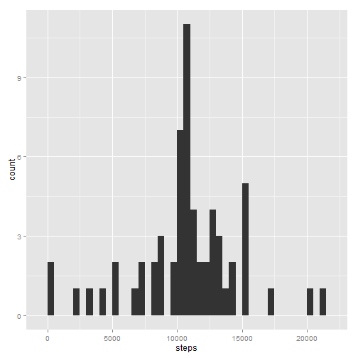

# Reproducible Research: Peer Assessment 1


## Loading and preprocessing the data


```r
act <- read.csv("activity.csv")
```


## What is mean total number of steps taken per day?

```r
library("ggplot2")
library("reshape2")
act.melt <- melt(act, id=c("date"), measure.vars=c("steps"),na.rm=TRUE)
steps.aggr <- dcast(act.melt, date ~ variable, sum)
qplot(steps, data=steps.aggr, binwidth = 500)
```

 


```r
mean.steps <- mean(steps.aggr$steps)
median.steps <- median(steps.aggr$steps)
```
The mean of the total number of steps taken each day is 10766.19 and the mediam is 10765.00.


## What is the average daily activity pattern?

```r
act.melt.inter <- melt(act, id=c("interval"), measure.vars=c("steps"), na.rm=TRUE)
steps.inter.aggr <- dcast(act.melt.inter, interval ~ variable, mean)
qplot(interval, steps, data = steps.inter.aggr, geom="line")
```

 


```r
max.inter <- steps.inter.aggr[which.max(steps.inter.aggr$steps),"interval"]
```
The interval 835.00 contains the maximum number of steps


## Imputing missing values


```r
mis.val <- sum(is.na(act$steps))
```
1.The total number of rows with missing values is 2304


2.Devise a strategy for filling in all of the missing values in the dataset. The strategy does not need to be sophisticated. For example, you could use the mean/median for that day, or the mean for that 5-minute interval, etc.
Strategy: To use the mean for the 5-minute interval.


```r
act.melt.inter <- melt(act, id=c("interval"), measure.vars=c("steps"), na.rm=TRUE)
steps.inter.aggr <- dcast(act.melt.inter, interval ~ variable, mean)

head(steps.inter.aggr)
```

```
##   interval   steps
## 1        0 1.71698
## 2        5 0.33962
## 3       10 0.13208
## 4       15 0.15094
## 5       20 0.07547
## 6       25 2.09434
```


3.Create a new dataset that is equal to the original dataset but with the missing data filled in.
Implementing strategy: Loping through the na values in the original dataset and finding for each interval the correpsonfing mean value in the dataset calculated in the previous point


```r
act.imp <- act
act.imp.na <- which(is.na(act.imp$steps))

for (i in act.imp.na) {
  int.na <- act.imp[i, "interval" ]
  tmp <- steps.inter.aggr[steps.inter.aggr$interval == int.na,]
  act.imp[i,1] <- tmp[1,2]
}

head(act.imp)
```

```
##     steps       date interval
## 1 1.71698 2012-10-01        0
## 2 0.33962 2012-10-01        5
## 3 0.13208 2012-10-01       10
## 4 0.15094 2012-10-01       15
## 5 0.07547 2012-10-01       20
## 6 2.09434 2012-10-01       25
```


4.Make a histogram of the total number of steps taken each day and Calculate and report the mean and median total number of steps taken per day. Do these values differ from the estimates from the first part of the assignment? What is the impact of imputing missing data on the estimates of the total daily number of steps?


```r
library("ggplot2")
library("reshape2")
act.melt.imp <- melt(act.imp, id=c("date"), measure.vars=c("steps"),na.rm=TRUE)
steps.aggr.imp <- dcast(act.melt.imp, date ~ variable, sum)
qplot(steps, data=steps.aggr.imp, binwidth = 500)
```

 


The mean of the total number of steps taken each day is 10766.19  and the mediam is 10766.19


## Are there differences in activity patterns between weekdays and weekends?
Yes, there are some differences in activity. During weekdays, there is just one peak, while on weekends there are several peaks. 


```r
act.imp$date <- as.Date(act.imp$date, "%Y-%m-%d")

act.imp$weekd <- sapply(weekdays(act.imp$date),switch,
  Monday="weekday",
  Tuesday="weekday",
  Wednesday="weekday",
  Thursday="weekday",
  Friday="weekday",
  Saturday="weekend",
  Sunday="weekend")


act.week <- melt(act.imp, id=c("interval","weekd"), measure.vars=c("steps"), na.rm=TRUE)
steps.week.aggr <- dcast(act.week, interval+weekd ~ variable, mean)

qplot(interval, steps, data = steps.week.aggr, geom="line")  + facet_wrap(~ weekd, nrow=2, ncol=1)
```

 
